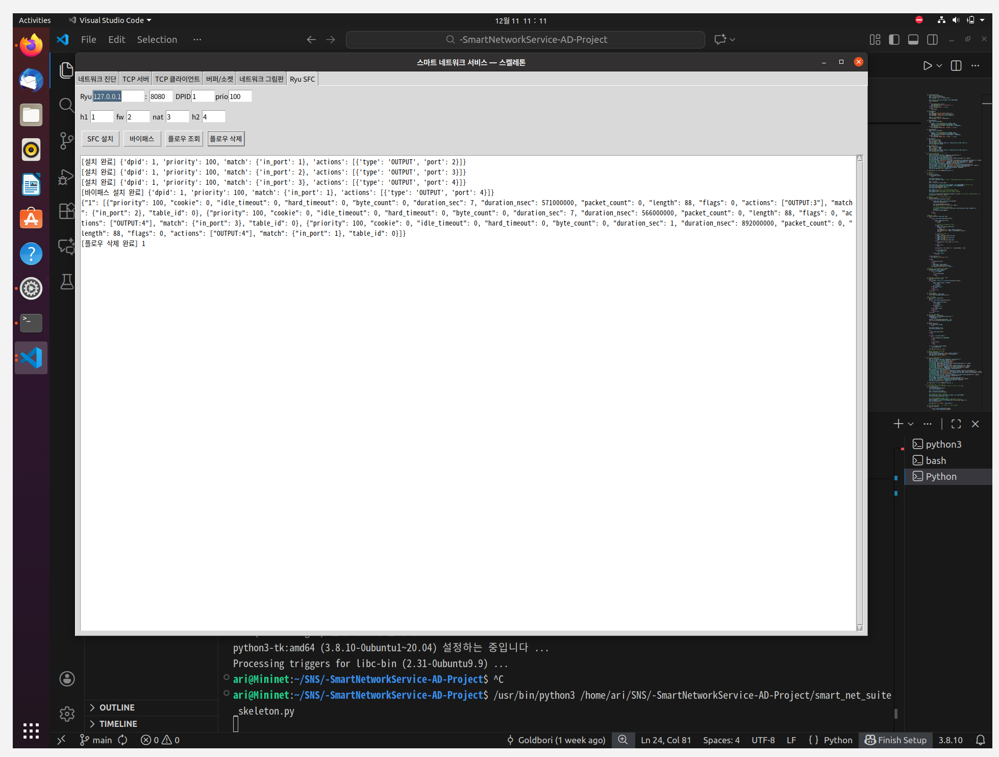

# -SmartNetworkService-AD-Project
25'-2 국민대학교 스마트네트워크서비스 수업 AD 프로젝트

---

## 👥 팀원 정보 (Team Members)

| 이름 | 학번 | 담당 |
|------|------|---------------------------------------------|
| **선현승** | 20203080 | 진단 핸들러, 네트워크 그림판, SFC(Ryu), 윈도우 환경 테스트, 발표 대본 작성 |
| **김아리** | 20223056 | 진단 핸들러, 서버-클라이언트 소켓 통신, 우분투 환경 테스트, 보고서 정리 |

---

## ✅ 요구사항 체크리스트 (16개)

| 번호 | 요구사항 설명 | 구현 여부 |
|------|----------------|-----------|
| 1 | ifconfig로 IP 구성 확인 | O |
| 2 | 바이트 정렬 함수 | O |
| 3 | IP 주소 변환 함수 | O |
| 4 | DNS와 이름 변환 | O |
| 5 | Server 상태 확인 | O |
| 6 | netstat -a -n -p tcp \| findstr 9000 | O |
| 7 | GUI TCP 서버 함수 상태 표시 | O |
| 8 | TCP 클라이언트 함수 상태 표시 | O |
| 9 | 소켓 데이터 구조체(버퍼) 상태 표시 | O |
| 10 | 네트워크 그림판 | O |
| 11 | 고정길이 전송 | O |
| 12 | 가변길이 전송 | O |
| 13 | 고정+가변 전송 | O |
| 14 | 데이터 전송 후 종료 | O |
| 15 | 멀티 스레드 동작 | O |
| 16 | 임계영역/이벤트 연습 | O |

---

## 🖥️ 실행 방법 (Execution Guide)

Windows 환경:
```bash
python smart_net_suite.py
```

Ubuntu 및 macOS 환경:
```bash
python3 smart_net_suite.py
```

사전 작업(Ubuntu 기준):
```bash
# tkinter 설치
sudo apt-get update
sudo apt-get install python3-tk

# requests 라이브러리 설치
pip install requests

# REST API와 함께 Ryu 실행
ryu-manager ryu.app.ofctl_rest
```

---

## 🔌 테스트 절차 (Test Procedure)

### 1) 네트워크 진단
- ipconfig/ifconfig
- netstat 필터
- 포트 오픈 검사
- hton/ntoh 데모
- inet_pton/ntop(IPv4)
- inet_pton/ntop(IPv6)
- DNS 조회
- 역방향 조회

### 2) 전송 모드 테스트 (FIXED / VAR / MIX 비교)
- FIXED: 정확한 32바이트 송신  
- VAR: '\n' 기준 메시지 구분  
- MIX: 4바이트 길이 + 본문

### 3) 멀티 스레드 동작 (클라이언트당 스레드 + 공유 카운터)
- 서버는 클라이언트마다 독립적인 스레드를 생성해 병렬로 수신 처리
- 공유 카운터 접근 시 threading.Lock()을 사용해 임계영역 충돌 방지
- 여러 클라이언트가 동시에 송신해도 카운터 정확히 증가
- 서버 탭 내에서 상태 갱신 버튼을 클릭해 접속 수 및 카운터 확인 
- 스레드 종료 시 threading.Event()으로 안전 종료

### 4) 네트워크 그림판 (브로드캐스트)
- `DRAW x1 y1 x2 y2` 패킷 생성 후 서버에 전송
- 서버는 모든 클라이언트에게 브로드캐스트
- 클라이언트는 수신한 패킷을 기반으로 렌더링하여 화면 동기화
- 브로드캐스트 옵션을 사용해 화면 동기화 여부 제어 가능

### 5) SFC(Ryu)
- h1 → fw → nat → h2 플로우 체인을 REST API로 설치
- h1 → h2 바이패스 플로우 설치로 서비스 펑션 우회
- GET /stats/flow/{dpid}로 현재 플로우 테이블 조회
- DELETE /stats/flowentry/clear/{dpid}로 모든 플로우 삭제

---

# 📂 프로그램 탭 소개

---

## 🟦 1. Server 탭
서버 시작/종료, 상태 갱신, 서버 로그 표시

### 1-1. 서버 시작
📸 스크린샷  


### 1-2. 클라이언트 접속 확인
📸 스크린샷  


### 1-3. 서버 상태 갱신
📸 스크린샷  


설명
- Start/Stop 서버 동작  
- 클라이언트 수 자동 갱신  
- Lock 기반 counter 증가  

---

## 🟩 2. Client 탭
클라이언트 연결/종료, 모드별 메세지 송신

### 2-1. 클라이언트 연결
📸 스크린샷  


### 2-2. 모드별 메세지 전송


### 2-3. 전송 후 종료


설명
- Connect 클릭 시 서버 접속  
- 송신 후 close 옵션 제공  

---

## 🟧 3. Buffer / Send 탭 (전송 모드)
FIXED / VAR / MIX 모드를 테스트하는 공간

📸 스크린샷  


설명
- 요구사항 11~14번 검증 가능  
- 모드 선택 → 송신 → 서버 로그 확인  

---

## 🟪 4. 네트워크 그림판
마우스를 이용한 실시간 네트워크 그림판

### 4-1. 브로드캐스트 OFF
📸 스크린샷  


### 4-2. 브로드캐스트 ON


설명
- 로컬 + 원격 동시 반영  
- DRAW x1 y1 x2 y2 패킷 구조  
- 그림판 브로드캐스트 ON/OFF 기능  

---

## 🟫 5. SFC(Ryu)

📸 스크린샷  


설명
- sfc_install()  # h1->fw->nat->h2 체인 설치
- sfc_bypass()   # h1->h2 바이패스 설치
- sfc_dump()     # 플로우 조회
- sfc_clear()    # 플로우 삭제

---

## 📦 프로젝트 구조

```
/SmartNetworkService/
│ smart_net_suite.py
└ README.md
```

---
